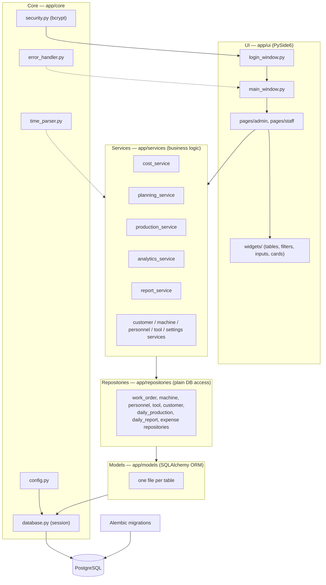
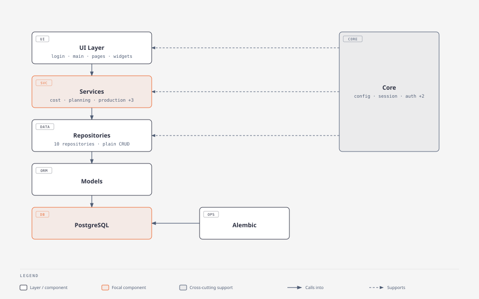

# CNC Manufacturing Cost Tracker


`Libraries:`      

A desktop ERP application for small CNC machining job shops, built to give shop owners a clear, per-process view of what each part actually costs to produce — and what it actually earns.

## The Problem

In a job shop, a single part often passes through several machines and operators before it's finished — turning, milling, grinding, and so on. Each of those steps has its own labor cost, machine time, tooling wear, and setup overhead. Without a system to track this, shop owners typically price jobs off gut feeling or a single blended margin, with no visibility into which specific processes are actually profitable and which are quietly eating the margin.

This application solves that by:

- Locking in **per-step cost snapshots** (labor rate, machine rate, tool cost) at the moment a work order is planned, so historical jobs stay accurate even after rates change later.
- Splitting the sale price into a **net price contribution per processing step**, proportional to how much time each step takes — so a shop can see exactly how much of a job's margin comes from turning vs. milling vs. finishing, for example.
- Tracking **planned vs. actual** processing time on every production entry and converting the deviation directly into a cost/gain figure.
- Rolling all of this up into cost, revenue, and performance dashboards by machine, customer, and time period.

## Key Features

- **Role-based access** — separate Admin and Staff logins with distinct menus and permissions.
- **Planning** — build a work order step by step (machine, operators, tools, processing time), with a live cost/price preview that recalculates as you edit.
- **Daily production entry** — log actual output per step per day; work orders auto-complete once the final step's quantity is fully produced.
- **Cost snapshot principle** — updating a machine's hourly rate or an employee's salary never rewrites the cost of work already planned or produced.
- **Analytics** — order tracking with step-by-step progress bars, planned-vs-actual deviation cost, machine performance, customer performance, and a revenue dashboard, all with day/week/month/quarter/year filtering.
- **Cost breakdown** — fixed and month-specific expenses, and a full cost pie chart (salaries, fixed costs, machine costs, one-off expenses) per month.
- **PDF daily reports** — one-click generation of a printable daily production summary.
- **Global error handling** — unhandled exceptions are caught, logged locally, and shown to the user without crashing the app.
- **Light/dark theme**, consistent across every screen.

## Tech Stack

| Layer | Technology |
|---|---|
| Language | Python 3.11+ |
| UI | [PySide6](https://doc.qt.io/qtforpython/) (Qt for Python) |
| Theme | [pyqtdarktheme](https://github.com/5yutan5/PyQtDarkTheme) — dark/light/system |
| ORM | SQLAlchemy 2.x |
| Database | PostgreSQL, via psycopg2 |
| Migrations | Alembic |
| Charts | Matplotlib, embedded via `FigureCanvasQTAgg` |
| Auth | bcrypt password hashing |
| PDF export | Qt's `QPrinter` / `QTextDocument` |
| Packaging | PyInstaller (`--onedir`, for Windows distribution) |
| Testing | pytest |

## Architecture





```
app/
├── core/          # config loading, DB session, password hashing, error handling, time parsing
├── models/        # SQLAlchemy ORM models, one file per table
├── repositories/  # plain DB access (CRUD + queries) — no business logic
├── services/       # all business logic and calculations (cost, planning, production, analytics)
└── ui/
    ├── login_window.py, main_window.py
    ├── widgets/    # shared components (tables, time/money inputs, date filters...)
    └── pages/
        ├── admin/  # admin-only screens
        └── staff/  # staff screens
```

The UI never performs calculations directly — every number shown on screen comes from a service function, which keeps the business logic unit-testable independently of the Qt layer. Repositories are a thin data-access layer; nothing but plain queries lives there.

## Getting Started

### Prerequisites

- Python 3.11+
- A running PostgreSQL instance

### Setup

```bash
python -m venv venv
source venv/bin/activate        # Windows: venv\Scripts\activate
pip install -r requirements.txt

cp config.example.ini config.ini
# edit config.ini with your PostgreSQL host/port/credentials

alembic upgrade head             # creates the schema
python scripts/seed.py           # creates demo login users
python main.py
```

### Demo logins

`scripts/seed.py` creates two accounts to explore the app with:

| Username | Password | Role |
|---|---|---|
| `admin1` | `admin123` | Admin |
| `staff1` | `staff123` | Staff |

The Personnel Setup page is additionally protected by a page-level password, `admin123` by default (changeable from within the page).

No business data (customers, machines, work orders, etc.) is seeded — the app starts empty so you can populate it with your own sample data.

### Running tests

```bash
pytest
```

## Future Work

- Further UI/UX polish across the analytics and planning screens.
- A tablet-optimized daily production entry screen, so operators can log output directly on the shop floor — replacing the paper production slips that most small shops still rely on today.

## License

MIT — see [LICENSE](LICENSE).
